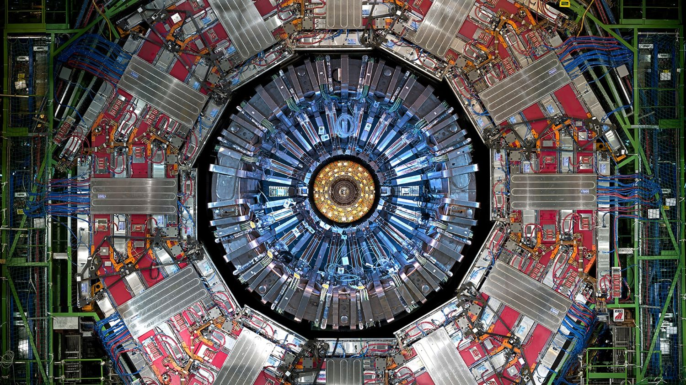

# Physics-Aware Gating for Jet Transformers 

Physics-Aware Gating (PAG) for Particle Transformers on the JetClass dataset: the attention blocks of `LorentzParT` and `ParticleTransformer` are gated by a signal built from the pairwise particle interactions and from the jet invariant mass in GeV, on top of self-supervised masked-particle pretraining and jet classification.

## Overview

A jet is a spray of particles, and a transformer over its constituents has no notion of which particles matter physically. PAG adds that notion: every attention block multiplies its attention output by a learned gate that is conditioned on physics quantities, so the model can damp or amplify each head according to the jet it is looking at.


*End view of the CMS detector at CERN, the experiment the JetClass simulation is modelled on*

The repository runs three comparable tracks on the same data:

| Track | Model | Gate | Configs |
|---|---|---|---|
| **PAG LorentzParT** | `LorentzParT` (ParT + LGATr `EquiLinear`) | on | `configs/*_PAG_LorentzParT.yaml` |
| **PAunG LorentzParT** | the same model | off, same pretraining | `configs/train_PAunG_LorentzParT.yaml` |
| **PAG ParT** | `ParticleTransformer` | on | `configs/*_PAG_ParT.yaml` |

Each track is two stages: self-supervised pretraining that masks one particle and reconstructs it with a momentum-conservation loss, then fine-tuning the pretrained encoder for 10-class jet classification.

Core components:
- Models: `src/models/` — `LorentzParT`, `ParticleTransformer`, the gated `ParticleAttentionBlock`, and the cosine-similarity classifier head.
- Engine: training/evaluation loops, logging, checkpointing (`src/engine/`).
- Configs: YAML-driven experiments (`configs/`).
- Jobs: Slurm batch scripts and one-command pipelines for NERSC Perlmutter (`jobs/`).

This project builds on [Hybrid_Transformer_Thanh_Nguyen](../Hybrid_Transformer_Thanh_Nguyen) by Thanh Nguyen, which provides the `LorentzParT` model, the training engine and the JetClass utilities.

## Access the repository

```bash
git clone https://github.com/gatetub/CMS.git
cd CMS/MAEs/PAG_AvishiktaBhattacharjee
```

### Prerequisites

- Python 3.13
- `lgatr==1.4.4` (the scripts refuse to start with any other version)
- PyTorch with CUDA for training; see https://pytorch.org/get-started/locally/

### Installation

On NERSC Perlmutter, one command sets everything up:

```bash
source jobs/setup_env.sh
```

It loads the NERSC Python module, runs `pip install --user "lgatr==1.4.4" uproot awkward tqdm vector`, and prints the torch, CUDA and lgatr versions it found.

Anywhere else:

```bash
python -m venv venv
source venv/bin/activate        # Windows: venv\Scripts\activate
pip install -r requirements.txt
```

### Copying the project to NERSC

```bash
scp -r PAG_AvishiktaBhattacharjee <user>@perlmutter.nersc.gov:~/
```

Submit every job from inside that folder; the jobs read their configs and write `logs/` and `plots/` relative to it.

## What the gate does

`ParticleAttentionBlock` (`src/models/particle_transformer.py`) computes the usual attention, then multiplies the result by `sigmoid(gate)`, where the gate is a linear function of:

1. the token itself,
2. the pooled pairwise interaction features `U` of that particle (ΔR, kT, z, m²), and
3. Fourier features of the **jet invariant mass in GeV**, whose frequencies span roughly 13–314 GeV so that the 10.8 GeV gap between the W and the Z is resolvable.

The gate is zero-initialised and rescaled by 2, so at step 0 the gated model is exactly the ungated one, and any improvement comes from what the gate learns. `gate_type: 'headwise'` gives one value per attention head, `'elementwise'` one per embedding dimension.

For the mass to be physical, the model needs GeV. `pT` and `E` are divided by **one shared constant**, so a normalised particle is still a genuine 4-vector and `m² = E² − |p|²` keeps its sign (`src/utils/data/normalize.py`); η and φ are never scaled. The model registers the inverse of that transform and recovers GeV internally (`DenormalizeMixin` in `src/models/processor.py`), while the network itself still consumes the normalised tensor. With `debug=True` each run prints the recovered constituent momenta and the jet mass reaching the gate, ending in `VERDICT: masses are physical`.

The classifier head compares L2-normalised features with L2-normalised class weights (cosine similarity × 30) instead of a plain linear layer.

## Data

The runs use a balanced JetClass subset stored as a single `.npz` archive with `X_particles` of shape `(num_jets, 4, 128)` and one-hot `Y`; per-particle features are `[pT, eta, phi, energy]`. `--npz-path` loads it and splits it 80/10/10, stratified with a fixed seed, and computes the normalisation from the training split (`src/utils/data/npz.py`). On NERSC the jobs read it from the path in `NPZ_PATH` at the top of each `jobs/*_PAG_*.sh`.

The scripts also still read the original JetClass ROOT files through `--train-data-dir` / `--val-data-dir` / `--test-data-dir`, with the files under `./data/`; that path needs a config of its own, since only the PAG/PAunG configs are kept here. JetClass is publicly available: https://zenodo.org/records/6619768

## Configuration

Experiments are YAML. The gate lives in the `attention` block of the model section:

```yaml
model:
    embed_dim: 128
    num_layers: 8
    max_num_particles: 128
    attention:
        use_gating: True
        gate_type: 'headwise'   # or 'elementwise'
        use_mass_bias: True     # condition the gate on the jet mass
    mask: True                  # True: masked pretraining, False: classification
    weights:                    # pretrained checkpoint, or pass --weights

train:
    batch_size: 128
    criterion: {name: 'conservation_loss', kwargs: {loss_coef: [0.25, 0.25, 0.25, 0.25]}}
    optimizer: {name: 'adamw', kwargs: {lr: 0.0001}}
    scheduler: {name: 'exponential_lr', kwargs: {gamma: 0.95}}
    callbacks: []               # pretraining runs all epochs; the best epoch is still saved
    num_epochs: 20
    logging_dir: 'logs'
    plots_dir: 'plots'
```

| Config | Stage |
|---|---|
| `pretrain_PAG_LorentzParT.yaml` | masked pretraining, gate on |
| `train_PAG_LorentzParT.yaml` | classification, gate on |
| `train_PAunG_LorentzParT.yaml` | classification, gate off (the comparison run) |
| `pretrain_PAG_ParT.yaml`, `train_PAG_ParT.yaml` | the same two stages for `ParticleTransformer` |

A typo inside `attention` raises an error instead of silently disabling the gate.

## Train and Evaluate

`scripts/train_LorentzParT.py` and `scripts/evaluate_LorentzParT.py` (and their `*_ParT.py` counterparts) read a YAML config and run one stage:

```bash
python -m scripts.train_LorentzParT \
    --config-path ./configs/pretrain_PAG_LorentzParT.yaml \
    --npz-path /path/to/jetclass_balanced_1M.npz
```

```bash
python -m scripts.train_LorentzParT \
    --config-path ./configs/train_PAG_LorentzParT.yaml \
    --npz-path /path/to/jetclass_balanced_1M.npz \
    --weights logs/LorentzParT/best/<pretrain run>.pt
```

```bash
python -m scripts.evaluate_LorentzParT \
    --config-path ./configs/train_PAG_LorentzParT.yaml \
    --npz-path /path/to/jetclass_balanced_1M.npz \
    --best-model-path logs/LorentzParT/best/<classifier run>.pt
```

Flags:
- `--config-path`: the YAML experiment.
- `--npz-path`: the `.npz` dataset; replaces the data folders and runs on a single GPU.
- `--weights`: pretrained model to fine-tune from; overrides `model.weights`. Only the `encoder.*` tensors are taken, and what did not match is reported.
- `--best-model-path`: the model to evaluate.
- `--checkpoint-path`: resume training from a trainer checkpoint.
- `--seed`, `--train-data-dir`, `--val-data-dir`, `--test-data-dir` for the ROOT-file workflow.

The scripts pass the dataset normalisation to the model, so the gate sees GeV, and they print `Best model saved to: ...` at the end of training. ROOT-file runs still use DDP across all visible GPUs.


##Results

```
logs/
├── slurm-<job name>-<job id>.out          # everything a job printed
├── LorentzParT/
│   ├── best/<run>.pt                      # best epoch by validation loss
│   ├── checkpoints/<run>.pt               # last epoch, for resuming
│   └── logging/<run>.csv                  # per-epoch losses and metrics
└── PAunG/LorentzParT/...                  # the ungated classifier, kept apart

plots/
├── LorentzParT/
│   ├── <pretrain run>_pretrain_history.png         # pT/eta/phi/energy and validation loss per epoch
│   ├── <pretrain run>_particle_reconstruction.png  # true vs predicted masked particle
│   ├── <classifier run>_train_history.png          # loss and accuracy per epoch
│   ├── <classifier run>_roc_curve.png
│   └── <classifier run>_confusion_matrix.png
├── PAunG/LorentzParT/...
└── ParticleTransformer/...
```

## Project Structure

```
PAG_AvishiktaBhattacharjee/
├── src/
│   ├── configs/           # dataclasses for the YAML configs
│   ├── engine/            # training/evaluation engine
│   ├── loss/              # conservation and classification losses
│   ├── models/            # gated attention blocks, LorentzParT, ParticleTransformer, processor
│   ├── optim/             # optimizer/scheduler registries
│   └── utils/             # data, normalisation, metrics, plots, environment check
├── scripts/               # CLI: train/evaluate for each model
├── configs/               # YAML experiments (PAG, PAunG)
├── jobs/                  # Slurm batch scripts + run_all pipelines + setup_env
├── tests/                 # unit tests, including the gating tests
├── logs/                  # job output, checkpoints, CSV logs
├── plots/                 # PNG figures per model
├── data/                  # ROOT files, if the ROOT workflow is used
└── assets/                # figures
```

